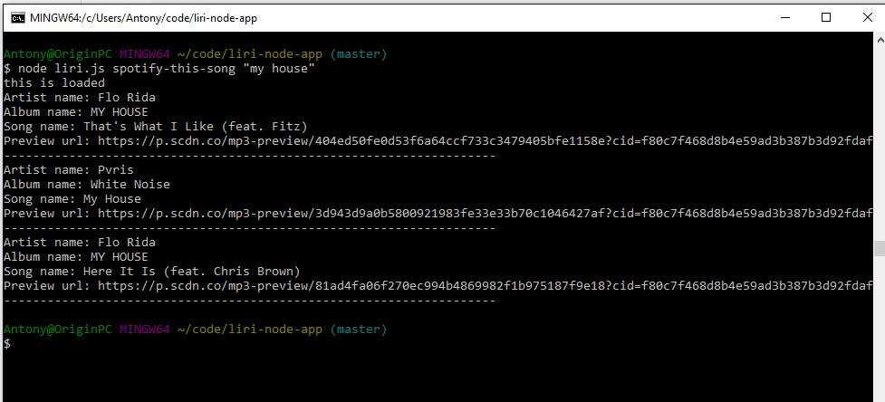

# liri-node-app
Language interpretation and recognition

Here is the result of "my-tweets" command:

Here is the result of "spotify-this-song" with no argument:

Here is the result of "spotify-this-song" with an argument:

Here is the result for "movie-this" when a movie is not specified by the user:

Here is the result for "movie-this" with a movie specified:

Here is the result for do-what-it-says with a movie-this command:

Here is the result for do-what-it-says with the spotify-this-song text:

Also completed bonus with log.txt file.